# Ejercicio 1 

## Introducción
En este ejercicio, la actividad principal conlleva la instalación de una maquina virtual con Docker para emular un sistema MacOs para el desarrollo de aplicaciones (de ejercicios posteriores) con XCode. 
La idea principal es comparar las capacidades de las PC´s y seleccionar la mejor para la instalación.

## 1.1 Identificación y Elección del Equipo
Para cumplir con los requisitos técnicos de virtualización, se realizó una comparativa del hardware disponible entre los integrantes del equipo.

**Comparativa de Equipos:**
* **PC 1 (Orozco Aguilar):** Laptop ASUS TUF Gaming A15, AMD Ryzen 7, 16GB RAM, 512 SSD NVMe. 
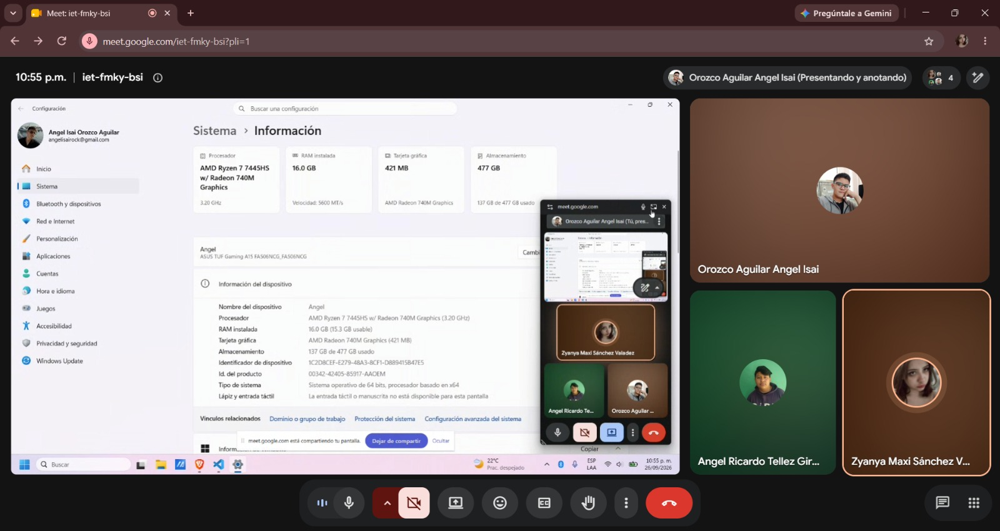 
* **PC 2 (Téllez Girón Castro):** Lenovo 20 FAS1H700, AMD Ryzen 7, 16GB RAM, 1 Tb. 
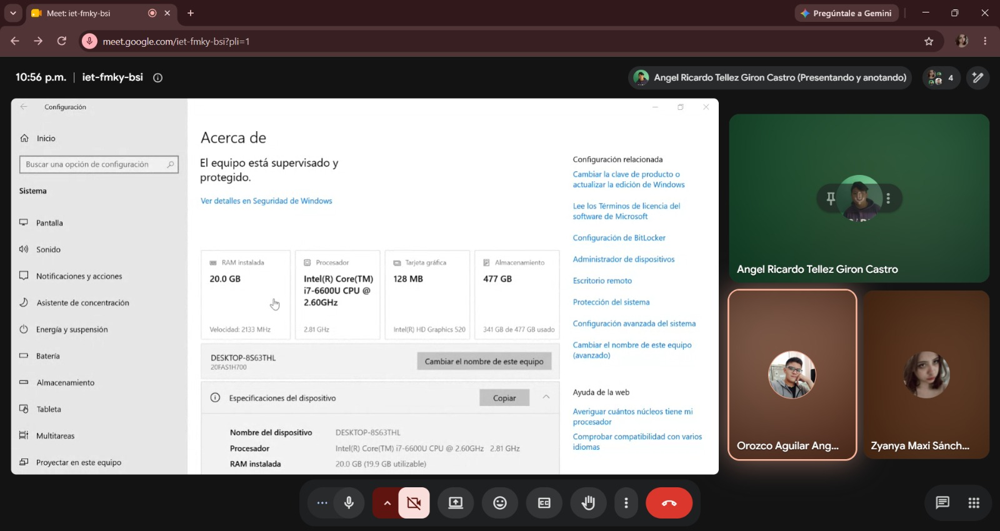 
* **PC 3 (Sánchez Valadez):** Laptos HP Victus 15, Intel Core I7, 20GB RAM, 512 SSD. 
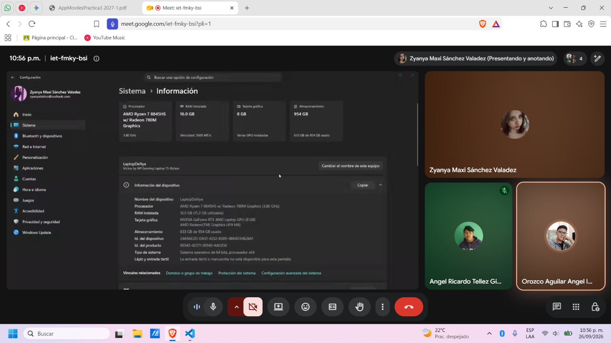 

**Justificación de la Elección:**
El desarrollo por cuestiones de tiempo del equipo (aunque no recomandado en la práctica), se decidió que Orozco y Sánchez instalaron el sistema emulado de MacOS y repartirse las actividades (Ejercicio 2, Sánchez) y (Ejercicio 3, Orozco), de forma que así se puede aprender de la tecnología por ambas partes sin depender de tantas reuniones.

**Integrante Responsable del Entorno:**
* **Nombre:** Orozco Aguilar Angel Isai, 2024630437
* **Boleta:** Sánchez Valadez Zyanya Maxi, 202463

## 1.2 Bitácora de Sesiones y Trabajo en Equipo
Aunque la instalación se realizó físicamente en el equipo ASUS TUF A15 y HP Victus 15, la actividad se desarrolló de forma conjunta mediante una sesione remotas con pantalla compartida, asegurando la participación de todos los integrantes, de forma que se adjuntan evidencias de la configuración de Sánchez y Orozco siguiendo los pasos en su dispositivo.

| Fecha | Hora Inicio | Hora Término | Modalidad | Integrantes Presentes | Actividades Realizadas |
| :--- | :--- | :--- | :--- | :--- | :--- |
| 26/09/2026 | 10:41 | 01:17 (27/09/2026) | Remota (Google Meet) | Orozco, Téllez, Sánchez | Configuración de WSL2 con Ubuntu, edición de `.wslconfig` y verificación de KVM. |

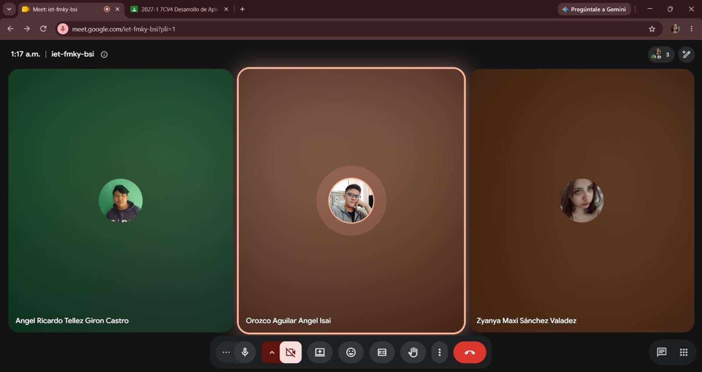 

## 1.3 Guía de Instalación de macOS con Docker
Se clonó el repositorio oficial `github.com/gabrielhuav/MacOS-Docker` y se configuró una distribución de Ubuntu en WSL 2 cómo se indicaba en el README. 
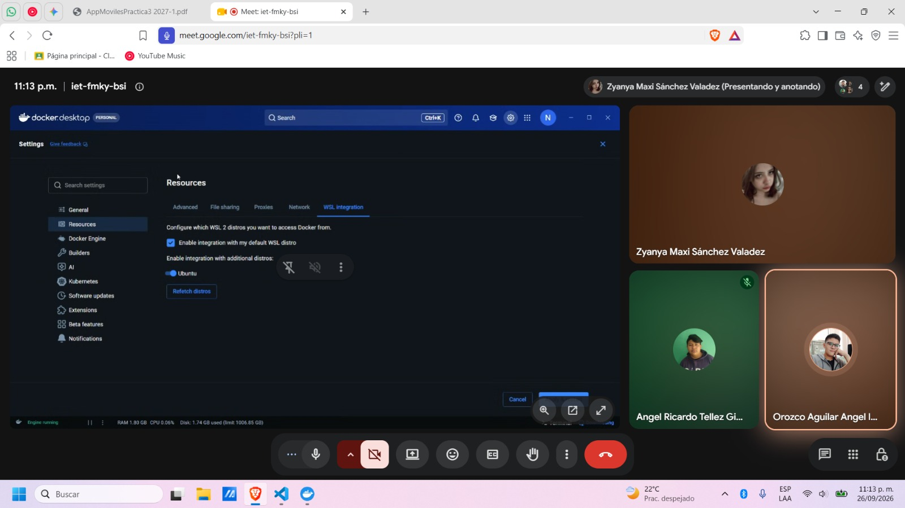 

1. **Configuración de Virtualización Anidada:** Se editó el archivo `.wslconfig` en el host Windows para habilitar `nestedVirtualization=true` y se validó el estado de KVM en Ubuntu mediante el comando `kvm-ok`. 
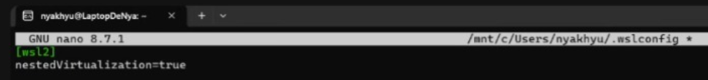 
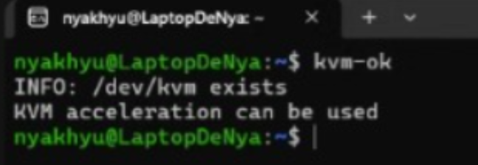 
2. **Ejecución del Contenedor:** Se asignaron recursos óptimos al contenedor (8GB RAM, 4 Cores, 8 SMP) y se ejecutó la imagen `sickcodes/docker-osx:latest` con redirección del display gráfico hacia el servidor X11 temporal (`/tmp/.X11-unix`). 
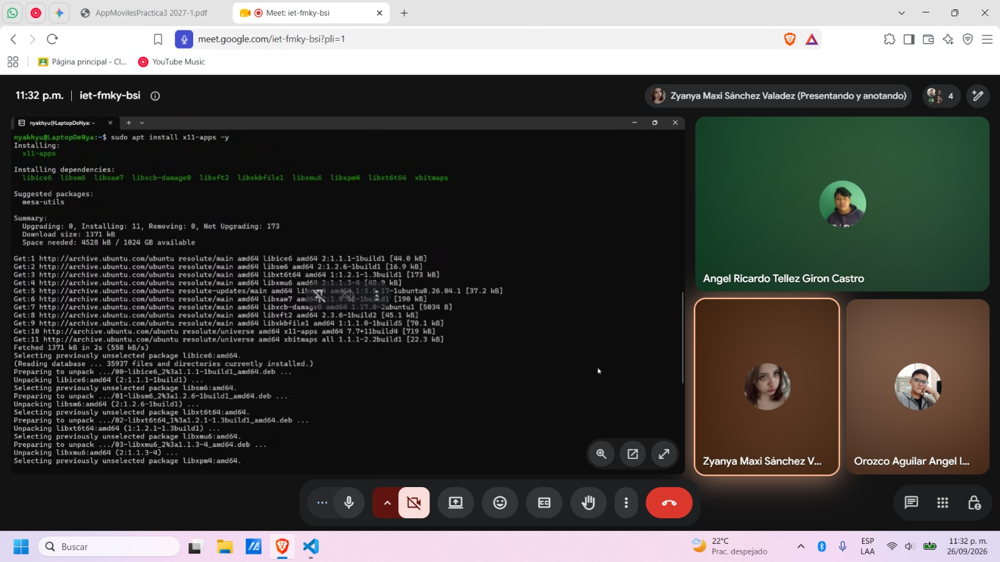 
3. **Preparación del Disco y Sistema:** Dentro de la interfaz gráfica de recuperación, se accedió a *Disk Utility* para formatear el disco virtual QEMU bajo el esquema APFS. Posteriormente, se procedió con la instalación de macOS. 
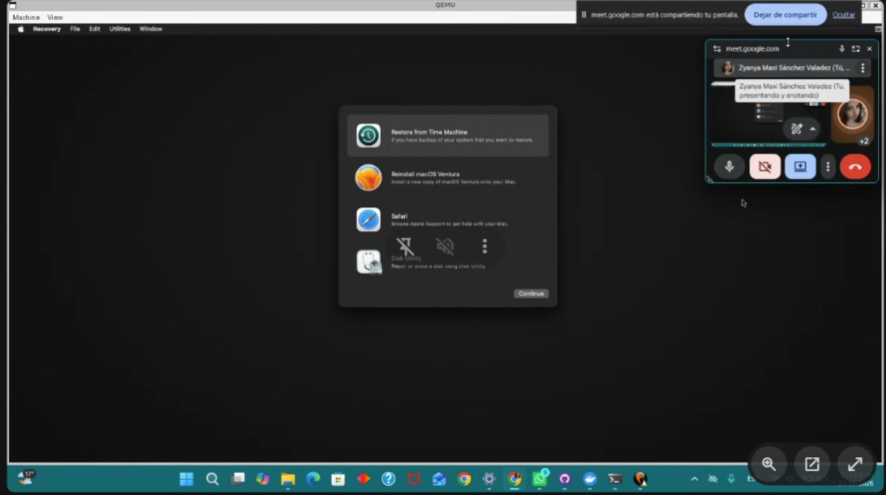 
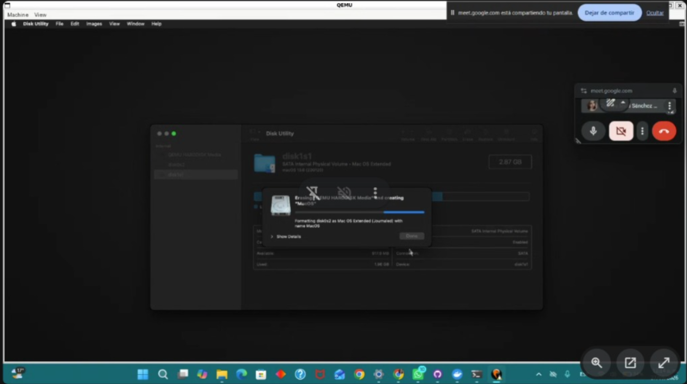 
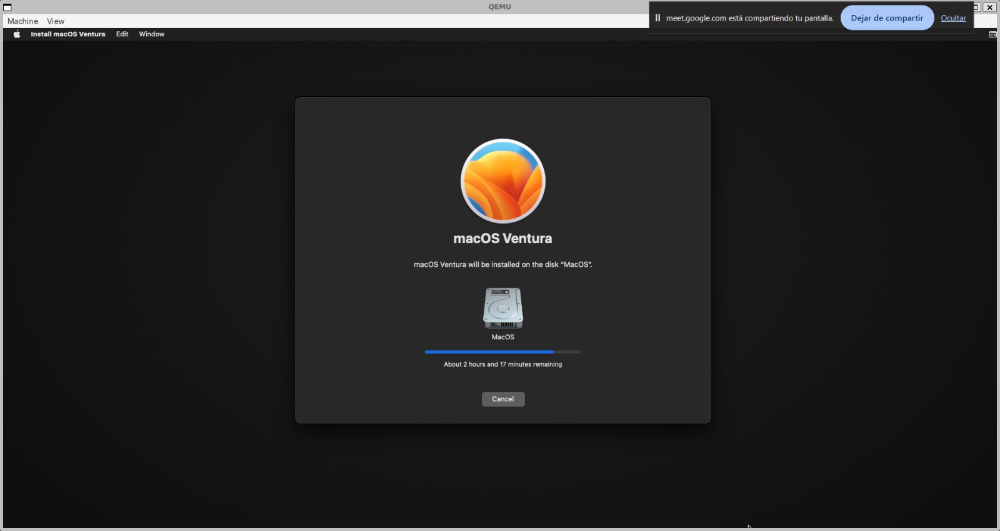 

## 1.4 Configuración del Entorno de Desarrollo iOS
Una vez iniciado el sistema operativo macOS virtualizado, se verificó el acceso a Internet y se procedió a configurar el entorno para el desarrollo móvil.

* **Instalación de Xcode:** Descargado e instalado directamente desde la Mac App Store del entorno virtualizado. 
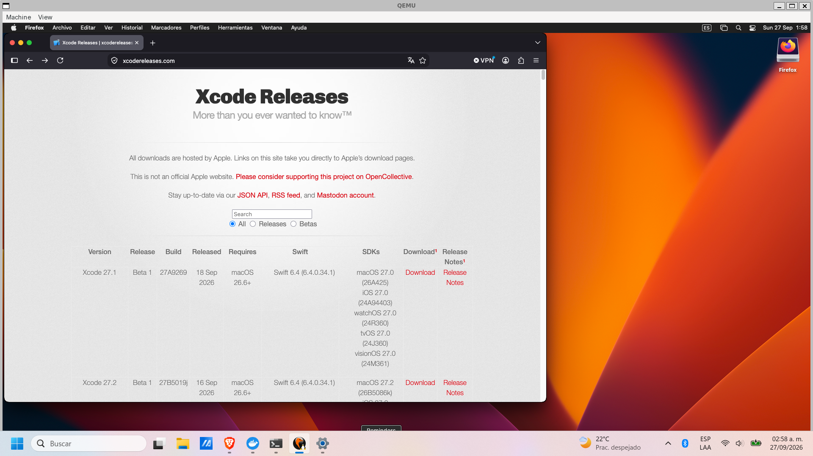 
* **Configuración de Simuladores:** Se descargaron los runtimes necesarios y se configuraron simuladores para iPhone y iPad dentro de Xcode.

* **Herramientas de Consola:** Se instaló Homebrew mediante la terminal de macOS, y a través de este, los gestores de dependencias solicitados (CocoaPods) y Swift Package Manager[cite: 1].
* **Proyecto de Prueba:** Se creó un proyecto base en Swift/SwiftUI compilado exitosamente para el simulador de iOS[cite: 1].

## Bibliografía
* Instituto Politécnico Nacional. (2026). *Práctica 3: Aplicaciones Nativas* [PDF]. Escuela Superior de Cómputo[cite: 1].