# Ejercicio 3: Aplicación de Cámara y Micrófono para iPhone (desarrollada desde macOS)

## Introducción:
La finalidad de este ejercicio es desarrollar una aplicación y compilarla desde MacOS (desde la Maquina Virtual Dockerizada), de forma que la aplicación pueda acceder a la cámara y al micrófono.

---

## 3.1: Configuración del Entorno:
- Verificar la instalación de XCode en MacOS Dockerizado. 
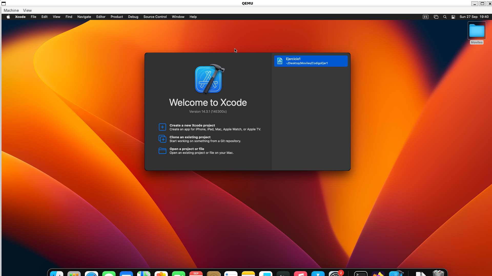 
- Configuración de los simuladores de iPhone y iPad dentro de XCode. 
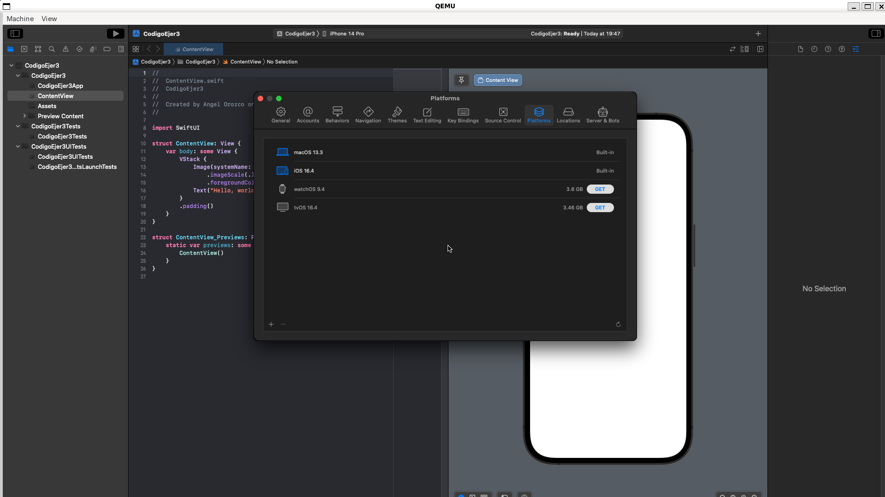 
- Verificar que la compilación y despliegue en simulador de iOS funcionan correctamente desde MacOS. 
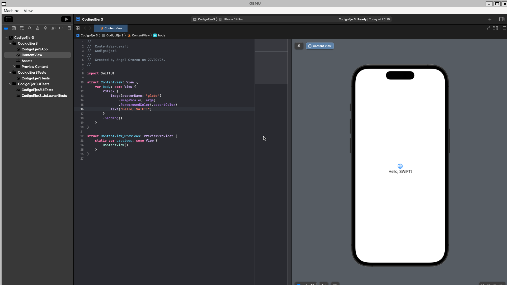 
- El proceso de configuración está detallado en el Ejercicio 1 de esta misma práctica, donde se muestran estas mismas pruebas.

---

## 3.2: Las Funcionalidades Principales:

A continuación se detallan las funcionalidades requeridas e implementadas en este módulo, junto con las evidencias de su correcta ejecución:

### 1. Configuración y Solicitud de Permisos
Para cumplir con las políticas de privacidad de Apple, se declararon las descripciones de uso en el archivo `Info.plist` y se programó la solicitud de permisos en tiempo de ejecución ante el usuario.
* `NSCameraUsageDescription` (Acceso a la cámara).
* `NSMicrophoneUsageDescription` (Acceso al micrófono). 
Permiso para acceder a la camara 
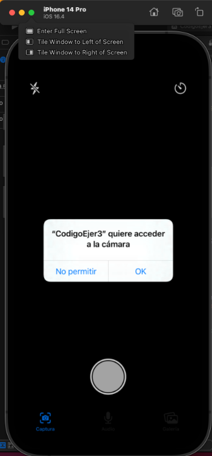 
Permiso para acceder al microfono 
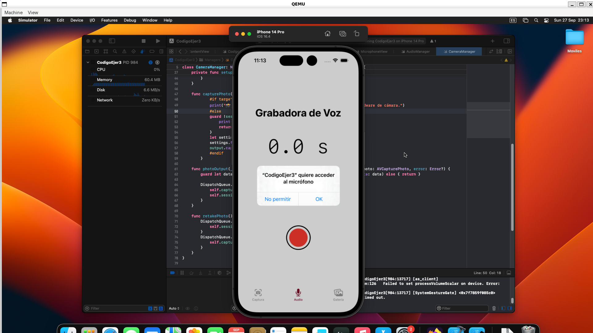 

### 2. Captura Fotográfica (`AVCaptureSession`)
Se integró el framework `AVFoundation` para manejar la sesión de la cámara del dispositivo. Se añadieron las siguientes opciones de personalización en la interfaz:
* **Control de Flash:** Activación y desactivación del flash LED.
* **Filtros Básicos:** Aplicación de filtros visuales sobre la imagen.
* **Temporizador:** Cuenta regresiva antes de accionar el obturador. 
Camara regular 
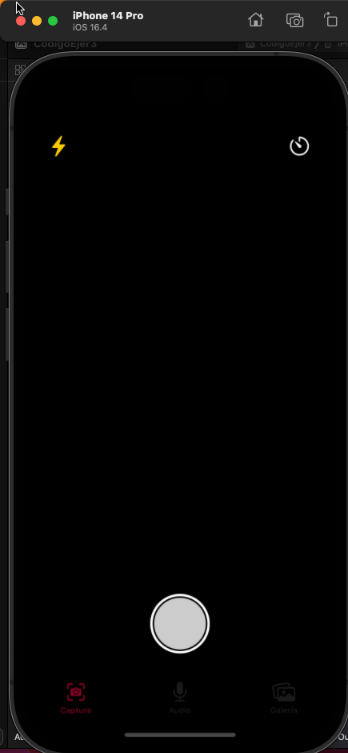 
Camara con colores de la escom 
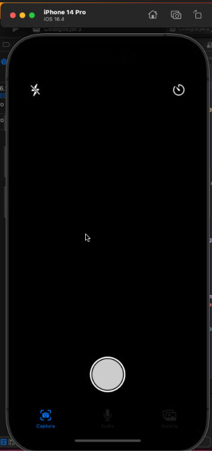 
Excepción por no tener dispositivo físico. 
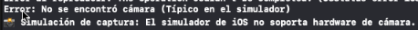 
Temporizador para la foto. 
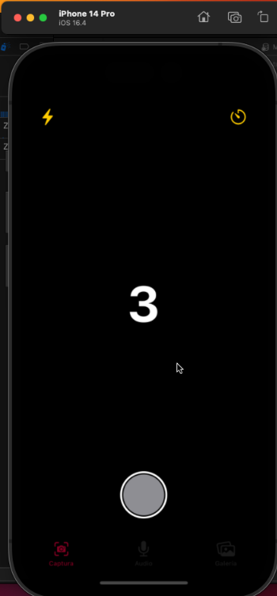 
Foto Falsa para simular captura 
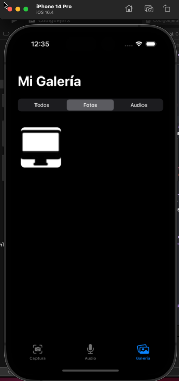 

### 3. Grabación de Audio (`AVAudioRecorder`)
Se implementó la captura de voz utilizando el micrófono. La interfaz de usuario refleja la actividad mediante:
* **Niveles de sensibilidad:** Retroalimentación visual del volumen de entrada (ondas o barra de volumen).
* **Temporizador de grabación:** Cronómetro que indica la duración de la nota de voz actual. 
Otorgar permiso al microfono  
 
Audio Grabado 

### 4. Gestión de Almacenamiento Local
Los archivos multimedia generados se procesan y almacenan adecuadamente dentro del directorio de documentos (`Document Directory`) de la aplicación (formatos de imagen y `.m4a` para audio), garantizando su persistencia temporal o permanente según la lógica de la app. 
Galería de audios e imagenes (Sin imagenes por falta de camara) 
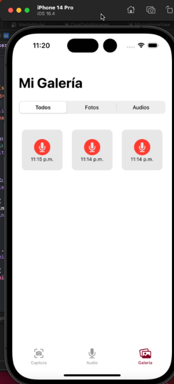 

### 5. Documentación de Entorno de Pruebas (Simulador vs. Hardware Real)
Debido a que el simulador de iOS carece de cámara física, se documenta la estrategia utilizada para la validación de este componente:

* **Estrategia utilizada:**
  * **Comprobación:** Se implementó un comprobante para saber si se ejecuta en simulador o en dispositivo físico, en caso de ser simulador, solo se dice hace una captura, en caso de ser un dispositivo físico, se toma la captura.

## 3.3 Interfaz de Usuario:

El diseño de la interfaz de usuario se enfocó en la accesibilidad, la coherencia institucional y la integración fluida con el ecosistema nativo de iOS. A continuación, se documentan las características visuales y de interacción implementadas:

### 1. Temas Personalizables (Identidad Institucional)
Se configuró una paleta de colores global y dinámica, permitiendo a la aplicación alternar su esquema visual entre dos perfiles basados en la identidad institucional:
* **Tema Guinda:** Color representativo del Instituto Politécnico Nacional (IPN).
* **Tema Azul:** Color representativo de la Escuela Superior de Cómputo (ESCOM). 
El cambio se muestra en la camara, cambia el color de la selección en la zona que se esté.

### 2. Soporte para Modo Claro y Oscuro
La interfaz garantiza una adaptación automática al modo de visualización configurado a nivel de sistema operativo en iOS. Mediante el uso de colores semánticos nativos (como `.primary`, `.secondary` o `UIColor.systemBackground`), los componentes, textos y fondos se ajustan sin perder contraste ni legibilidad. 
Muestra de configuración a modo oscuro 
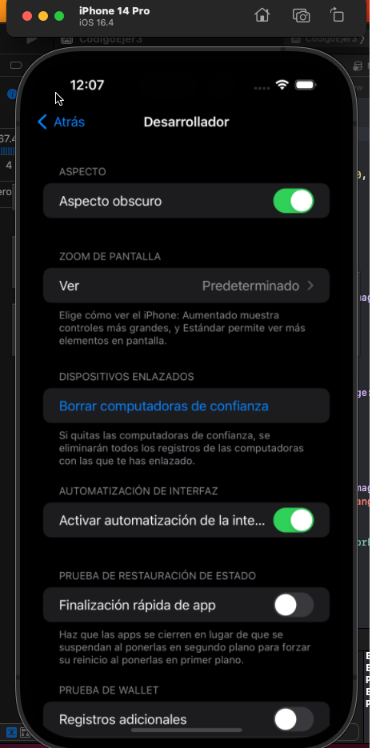 
Muestra de galería en Modo Oscuro 
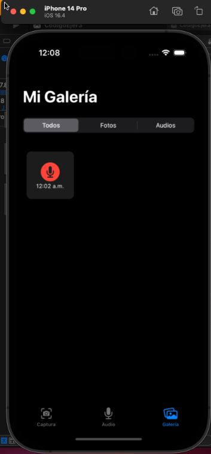 

### 3. Usabilidad y Controles Accesibles
La estructura de navegación y los componentes interactivos se diseñaron siguiendo las Guías de Interfaz Humana (HIG) de Apple. Se priorizó una jerarquía visual clara, utilizando iconografía nativa (SF Symbols) y garantizando áreas de toque (tap targets) de al menos 44x44 puntos para maximizar la accesibilidad. 
Se puede apreciar en capturas anteriores.

## 3.4 Almacenamiento local:

Esta sección detalla la persistencia de datos implementada para garantizar que los recursos multimedia y su información asociada se conserven de manera estructurada y eficiente en el dispositivo:

### 1. Persistencia de Archivos Multimedia
Las fotografías y grabaciones de audio generadas durante el uso de la aplicación se guardan de forma persistente dentro del sistema de archivos local (específicamente en el `Document Directory` de la app). Esto asegura que los archivos físicos no se pierdan al cerrar la aplicación y permanezcan aislados de otras aplicaciones del sistema. 
Persistencia de Archivos Multimedia 
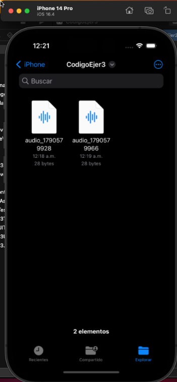 
El audio no se graba porque no tiene acceso a un microfono real, pero se guarda correctamente. 
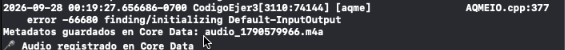 

### 2. Gestión de Metadatos con Core Data
Se integró el framework `Core Data` para establecer una base de datos local relacional. En lugar de guardar archivos pesados directamente en la base de datos, Core Data almacena referencias a las rutas de los archivos físicos junto con sus metadatos asociados:
* **Fecha:** Marca temporal de captura.
* **Ubicación:** Coordenadas GPS o texto descriptivo.
* **Etiquetas (Tags):** Palabras clave asignadas por el usuario para facilitar el filtrado y búsqueda.
 
Captura de la consola guardando la imagen 
 
Captura del código con los MetaDatos 
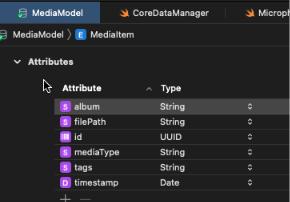 

### 3. Optimización con Miniaturas y Caché
Para garantizar una experiencia de usuario fluida y evitar el agotamiento de la memoria (Out of Memory) al cargar múltiples imágenes de alta resolución en la galería, se implementó un sistema de optimización:
* **Miniaturas (Thumbnails):** Generación de versiones de baja resolución al momento de capturar o importar una imagen.
* **Caché:** Uso de memoria temporal (como `NSCache`) para retener estas miniaturas, permitiendo un desplazamiento rápido y sin interrupciones en la cuadrícula de la galería. 
Captura de la meustra de que se almacenan correctamente los datos y cómo es que se meustran los datos en caché correctamente 
 
