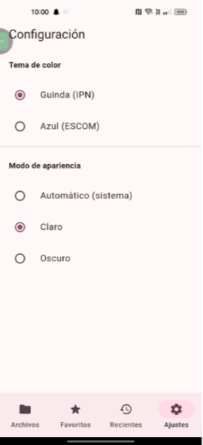

# Ejercicio 4 — Gestor de Archivos Multiplataforma (Flutter)

## Opción elegida

**Opción A: Gestor de archivos**, con funcionalidades equivalentes a las del Ejercicio 2 (Gestor de Archivos nativo en iOS/SwiftUI), pero implementado de forma multiplataforma con Flutter para que funcione tanto en Android como en iOS desde una sola base de código.

---

## ¿Qué hace la aplicación?

Es un gestor de archivos que permite explorar, organizar y previsualizar archivos dentro del espacio privado (sandbox) de la app, sin necesidad de conexión a internet. Incluye:

- **Explorador jerárquico de archivos**: navega por carpetas con una barra de ruta (breadcrumb) que siempre muestra dónde estás.
- **Búsqueda y ordenamiento**: por nombre, fecha o tamaño, ascendente o descendente.
- **Gestión de archivos**: crear carpetas, renombrar, copiar, mover y eliminar (con confirmación).
- **Importar archivos externos**: desde el selector nativo del sistema (Archivos/Google Drive/iCloud).
- **Compartir/exportar**: usando la hoja de compartir nativa del sistema operativo.
- **Visor de texto**: abre y edita archivos `.txt`, `.md`, `.json`, código fuente, etc.
- **Visor de imágenes**: con zoom, pan y rotación.
- **Otros tipos de archivo** (PDF, audio, video): se abren con el visor nativo del sistema.
- **Favoritos**: marca archivos/carpetas importantes para acceso rápido, persistente entre sesiones.
- **Recientes**: historial de las últimas carpetas/archivos visitados.
- **Gestos táctiles**: deslizar para eliminar, mantener presionado para menú contextual, deslizar hacia abajo para actualizar (pull-to-refresh).
- **Dos temas institucionales**: Guinda (IPN) y Azul (ESCOM), cada uno con adaptación automática a modo claro/oscuro del sistema.
- **Funciona 100% sin conexión a internet**, con toda la persistencia guardada localmente en el dispositivo.

> **Nota importante sobre "Recientes":** una carpeta o archivo solo aparece en la pestaña "Recientes" **después de haber entrado/navegado dentro de ella al menos una vez** (no basta con crearla y verla listada). Esto es intencional: el historial registra lo que el usuario efectivamente visita, igual que en un explorador de archivos de escritorio.

---

## ¿Cómo se construyó? (resumen del proceso)

La app se desarrolló siguiendo **Clean Architecture**, dividiendo el código en 3 capas independientes:

1. **`domain/`** (lógica de negocio pura, sin depender de Flutter ni de plugins):
   - **Entidades**: `FileItem` (representa un archivo/carpeta) y `AppSettings` (preferencias del usuario).
   - **Repositorios (contratos/interfaces)**: `FileRepository` y `SettingsRepository` — definen QUÉ operaciones existen, sin decir CÓMO se hacen.
   - **Casos de uso**: una clase por cada acción de negocio (listar, crear carpeta, renombrar, copiar, mover, eliminar, ordenar/filtrar), cada una con una sola responsabilidad.

2. **`data/`** (implementación real, aquí sí se usan plugins y `dart:io`):
   - **Datasources**: `FileSystemDataSource` (lee/escribe el disco real con `dart:io`, `path_provider`, `path`, `mime`, `file_picker`, `share_plus`) y `LocalStorageDataSource` (persistencia con Hive: preferencias, favoritos, recientes).
   - **Repositorios (implementaciones concretas)**: `FileRepositoryImpl` y `SettingsRepositoryImpl`, que cumplen los contratos definidos en `domain/` conectándolos con los datasources.

3. **`presentation/`** (interfaz visual y estado):
   - **Providers** (`ChangeNotifier` + paquete `provider`): `ThemeProvider` (tema Guinda/Azul y modo claro/oscuro), `FileExplorerProvider` (navegación, listado, búsqueda, orden, operaciones), `FavoritesProvider` (estado de favoritos).
   - **Pantallas**: Explorador de archivos, Favoritos, Recientes, Ajustes, Visor de texto, Visor de imágenes, Selector de carpeta destino.
   - **Widgets reutilizables**: fila de archivo con gestos (`FileTile`), barra de ruta (`BreadcrumbBar`), diálogos de nombre, menú de ordenamiento.

En `main.dart` se realiza la **inyección de dependencias**: se arman manualmente las instancias de datasources → repositorios → casos de uso → providers, y se conectan a la interfaz con `MultiProvider`.

---

## Plugins/paquetes utilizados y por qué

| Paquete | Uso | Justificación |
|---|---|---|
| `provider` | Gestión de estado | Recomendado oficialmente por el equipo de Flutter; simple y suficiente para el alcance del proyecto. |
| `hive` / `hive_flutter` | Persistencia local | Base de datos clave-valor en Dart puro (sin código nativo extra); más rápida que SQL para datos simples como preferencias, favoritos y recientes. |
| `path_provider` | Acceso al sandbox del sistema | Da la ruta segura y privada de la app en cada plataforma (Documents, tmp), equivalente multiplataforma al sandbox de iOS. |
| `path` | Manejo de rutas | Evita construir rutas manualmente con `/` o `\`, siendo compatible en todas las plataformas. |
| `mime` | Detección de tipo de archivo | Clasifica archivos por extensión/tipo MIME, jugando el mismo papel que `UTType` en iOS nativo. |
| `file_picker` | Importar archivos externos | Abre el selector nativo del sistema (Archivos/iCloud en iOS, almacenamiento/Drive en Android). |
| `share_plus` | Compartir/exportar | Abre la hoja de compartir nativa del sistema operativo. |
| `photo_view` | Visor de imágenes | Zoom, pan y rotación con gestos, tal como pedía el ejercicio original. |
| `open_filex` | Vista previa nativa | Abre archivos no soportados por un visor propio (PDF, audio, video) con la app nativa del sistema — equivalente a Quick Look de iOS. |
| `intl` | Formato de fechas | Formatea fechas de modificación de forma legible. |

---

## Requisitos previos

- Flutter SDK 3.19 o superior
- Android Studio (con Android SDK configurado) para compilar/ejecutar en Android
- Xcode (solo disponible en macOS) para compilar/ejecutar en iOS
- Un dispositivo físico o emulador/simulador

---

## Cómo ejecutar el proyecto

### 1. Clonar el repositorio e instalar dependencias

```bash
git clone <url-del-repositorio>
cd Ejercicio4
flutter pub get
```

### 2. Ejecutar en Android

1. Conecta un dispositivo Android físico por USB con la **depuración USB activada** (Ajustes → Opciones de desarrollador → Depuración USB), o abre un emulador desde Android Studio.
2. Verifica que Flutter detecte el dispositivo:
```bash
   flutter devices
```
3. Ejecuta la app:
```bash
   flutter run
```
   (si tienes varios dispositivos conectados, especifica cuál usar con `flutter run -d <device_id>`)

**Para generar el APK final (release):**
```bash
flutter build apk --release
```
El archivo se genera en: build/app/outputs/flutter-apk/app-release.apk


### 3. Ejecutar en iOS

> Requiere una Mac con Xcode instalado (o el entorno `macOS-Docker` / Mac-in-Cloud mencionado en el ejercicio).

1. Desde una Mac, abre una terminal en la carpeta del proyecto y obtén las dependencias:
```bash
   flutter pub get
```
2. Instala los pods de iOS (dependencias nativas):
```bash
   cd ios
   pod install
   cd ..
```
3. Abre un simulador de iPhone (o conecta un dispositivo físico):
```bash
   open -a Simulator
```
4. Ejecuta la app:
```bash
   flutter run
```

**Para generar el build de iOS:**
```bash
flutter build ios --release
```
Después, desde Xcode (`ios/Runner.xcworkspace`), se puede archivar y exportar el `.ipa`, o simplemente tomar capturas de pantalla ejecutando en el simulador, según lo permite el ejercicio si no se cuenta con una Mac disponible.

---

## Permisos declarados

- **Android** (`android/app/src/main/AndroidManifest.xml`): permisos de lectura de almacenamiento y medios (imágenes, video, audio) para Android 13+.
- **iOS** (`ios/Runner/Info.plist`): `NSPhotoLibraryUsageDescription` (acceso a fotos), `UIFileSharingEnabled` y `LSSupportsOpeningDocumentsInPlace` (para exponer los documentos de la app en la app "Archivos" de iOS).

---

## Estructura del proyecto

```
lib/
├── core/
│   ├── theme/
│   │   ├── app_colors.dart          # Colores base: Guinda (IPN) y Azul (ESCOM)
│   │   └── app_theme.dart           # ThemeData claro/oscuro con Material 3
│   └── utils/
│       └── file_utils.dart          # Formato de tamaños, fechas e íconos por tipo de archivo
│
├── domain/
│   ├── entities/
│   │   ├── file_item.dart           # Entidad: archivo o carpeta
│   │   └── app_settings.dart        # Entidad: preferencias (tema, orden, última carpeta)
│   ├── repositories/
│   │   ├── file_repository.dart         # Contrato de operaciones sobre archivos
│   │   └── settings_repository.dart     # Contrato de preferencias/favoritos/recientes
│   └── usecases/
│       ├── list_directory_usecase.dart
│       ├── create_folder_usecase.dart
│       ├── rename_item_usecase.dart
│       ├── delete_item_usecase.dart
│       ├── copy_item_usecase.dart
│       ├── move_item_usecase.dart
│       └── sort_and_filter_files_usecase.dart
│
├── data/
│   ├── datasources/
│   │   ├── file_system_datasource.dart      # Acceso real a disco (dart:io, path_provider, file_picker, share_plus)
│   │   └── local_storage_datasource.dart    # Persistencia con Hive
│   └── repositories/
│       ├── file_repository_impl.dart
│       └── settings_repository_impl.dart
│
├── presentation/
│   ├── providers/
│   │   ├── theme_provider.dart          # Estado del tema (Guinda/Azul, claro/oscuro)
│   │   ├── file_explorer_provider.dart  # Estado del explorador (navegación, búsqueda, orden, operaciones)
│   │   └── favorites_provider.dart      # Estado de favoritos
│   ├── screens/
│   │   ├── home_shell.dart              # Navegación principal (4 pestañas)
│   │   ├── file_explorer_screen.dart    # Explorador de archivos
│   │   ├── favorites_screen.dart        # Pantalla de favoritos
│   │   ├── recent_screen.dart           # Pantalla de recientes
│   │   ├── settings_screen.dart         # Pantalla de configuración/tema
│   │   ├── text_viewer_screen.dart      # Visor/editor de archivos de texto
│   │   ├── image_viewer_screen.dart     # Visor de imágenes con zoom
│   │   └── folder_picker_screen.dart    # Selector de carpeta destino (copiar/mover)
│   └── widgets/
│       ├── file_tile.dart               # Fila de archivo con gestos (swipe, long-press)
│       ├── breadcrumb_bar.dart          # Barra de ruta jerárquica
│       ├── name_input_dialog.dart       # Diálogo de texto (crear carpeta/renombrar)
│       └── sort_options_sheet.dart      # Menú de ordenamiento
│
└── main.dart   # Punto de entrada: inicializa Hive e inyecta todas las dependencias
```

## Capturas de pantalla

Las capturas de la aplicación funcionando en un dispositivo Android físico se encuentran en la carpeta [`../Documentacion/imageneseje4`](../Documentacion/imageneseje4).

### Explorador de archivos


### Favoritos


### Recientes


### Ajustes (temas Guinda/Azul y modo claro/oscuro)
