# Ejercicio 5 — CamMic KMP

<p align="center">
  <strong>Instituto Politécnico Nacional</strong><br>
  <strong>Escuela Superior de Cómputo</strong><br>
  Desarrollo de Aplicaciones Móviles Nativas<br>
  Práctica 3: Aplicaciones Nativas
</p>

---

## Datos de la entrega

| Dato | Información |
|---|---|
| Instituto | Instituto Politécnico Nacional |
| Escuela | Escuela Superior de Cómputo |
| Materia | Desarrollo de Aplicaciones Móviles Nativas |
| Práctica | Práctica 3: Aplicaciones Nativas |
| Ejercicio | Ejercicio 5 — Desarrollo Multiplataforma con Kotlin Multiplatform |
| Proyecto | CamMic KMP |
| Opción seleccionada | Opción B — Aplicación de cámara y micrófono |
| Fecha | 28 de septiembre de 2026 |
| Profesor(a) | Gabriel Hurtado Avilés |

### Integrantes

| # | Nombre completo | Número de boleta |
|---|---|---|
| 1 | Orozco Aguilar Angel Isai | 2024630437 |
| 2 | Sánchez Valadez Zyanya Maxi | 2024630593 |
| 3 | Téllez Girón Castro Angel Ricardo | 2024630154 |

---

## 1. Descripción

**CamMic KMP** es una aplicación desarrollada con **Kotlin Multiplatform (KMP)** y **Compose Multiplatform** cuyo propósito es compartir la mayor cantidad posible de interfaz y lógica entre Android e iOS, manteniendo implementaciones específicas para los recursos que dependen de cada plataforma.

Para este ejercicio se seleccionó la **Opción B: aplicación de cámara y micrófono**, en concordancia con la indicación de desarrollar funcionalidades similares a las del ejercicio de cámara y audio, pero ahora utilizando un enfoque multiplataforma.

La aplicación permite en Android:

- tomar fotografías con la cámara del dispositivo;
- cambiar entre cámara frontal y trasera;
- controlar el flash;
- utilizar temporizador de captura;
- aplicar filtros a las fotografías;
- grabar audio con distintos niveles de sensibilidad;
- usar temporizador de grabación;
- reproducir grabaciones almacenadas;
- consultar fotografías y audios desde una galería integrada;
- clasificar contenido mediante categorías persistentes;
- cambiar entre los temas institucionales **Guinda IPN** y **Azul ESCOM**;
- adaptarse automáticamente al modo claro u oscuro del sistema;
- conservar preferencias y categorías de forma local;
- funcionar sin conexión a Internet.

> **Estado de plataformas:** la versión Android fue implementada y probada en un dispositivo físico. La estructura KMP incluye `iosMain`, pero la compilación y validación funcional final en macOS/Xcode queda pendiente y se documenta en una sección específica de este README.

---

## 2. Objetivo

El objetivo del ejercicio es construir una aplicación multiplataforma para Android e iOS utilizando Kotlin Multiplatform, compartiendo lógica e interfaz en un módulo común y utilizando implementaciones específicas por plataforma cuando el acceso a cámara, micrófono, permisos o almacenamiento lo requiere.

Además, el ejercicio permite contrastar este enfoque con Flutter, utilizado en el ejercicio anterior de la práctica.

---

## 3. Funcionalidades implementadas

### 3.1 Cámara

La pantalla de cámara integra las siguientes funciones:

- vista previa de cámara en tiempo real;
- captura de fotografías;
- cambio entre cámara frontal y trasera;
- flash:
  - apagado;
  - encendido;
  - automático;
- temporizador:
  - sin temporizador;
  - 3 segundos;
  - 5 segundos;
- filtros:
  - Original;
  - Blanco y negro;
  - Sepia;
- almacenamiento local de las fotografías tomadas.

### Comportamiento de los filtros

En la implementación Android, el filtro **no modifica la vista previa de la cámara**. La vista previa permanece en color normal.

El flujo utilizado es:

```text
Vista previa normal
       ↓
Selección del filtro
       ↓
Captura con CameraX
       ↓
Generación del archivo JPG
       ↓
Procesamiento de la imagen
       ↓
Aplicación del filtro seleccionado
       ↓
Guardado local
       ↓
Visualización del resultado en la galería
```

Por esta razón, el efecto del filtro se observa **después de tomar la fotografía**, al consultar la imagen almacenada.

---

## 3.2 Micrófono y audio

El módulo de audio incluye:

- solicitud de permiso de micrófono;
- grabación de audio;
- contador de tiempo;
- selección de sensibilidad:
  - baja;
  - normal;
  - alta;
- indicador visual del nivel de entrada;
- temporizador de grabación;
- almacenamiento local en formato `.m4a`;
- listado de grabaciones;
- reproducción y detención del audio almacenado.

En Android se utilizan las APIs nativas `MediaRecorder` y `MediaPlayer`.

---

## 3.3 Galería multimedia

La aplicación cuenta con una galería propia que integra fotografías y grabaciones.

Incluye:

- vista unificada de fotos y audios;
- filtro por tipo:
  - Todo;
  - Fotos;
  - Audios;
- miniaturas de fotografías;
- reproducción directa de grabaciones;
- ordenamiento por fecha de modificación;
- actualización manual del contenido;
- categorías persistentes.

### Categorías disponibles

```text
General
Escuela
Personal
Proyecto
```

Cada fotografía o grabación puede asignarse a una categoría. Posteriormente es posible filtrar la galería por dicha categoría.

Las asociaciones se conservan incluso después de cerrar completamente la aplicación.

---

## 3.4 Temas institucionales

La aplicación implementa dos temas:

- **Guinda IPN**
- **Azul ESCOM**

Los temas modifican la paleta de Material Design 3 y además respetan automáticamente la configuración de modo claro u oscuro del sistema operativo.

La selección Guinda/Azul también se conserva después de cerrar y volver a abrir la aplicación.

---

## 4. Tecnologías utilizadas

| Tecnología / API | Uso dentro del proyecto |
|---|---|
| Kotlin 2.4.20 | Lenguaje principal |
| Kotlin Multiplatform | Compartición de código entre Android e iOS |
| Compose Multiplatform 1.12.1 | Interfaz compartida |
| Material Design 3 | Diseño de la interfaz |
| Android Gradle Plugin 9.1.1 | Construcción del proyecto Android |
| CameraX 1.6.2 | Vista previa y captura de fotografías en Android |
| Kotlin Coroutines 1.10.2 | Temporizadores y operaciones asíncronas |
| Kotlin Flow / StateFlow | Manejo reactivo del estado del audio |
| MediaRecorder | Grabación de audio en Android |
| MediaPlayer | Reproducción de audio en Android |
| Bitmap / ColorMatrix | Procesamiento de filtros de imagen en Android |
| SharedPreferences | Persistencia de preferencias y categorías en Android |
| NSUserDefaults | Implementación equivalente de preferencias para iOS |
| expect / actual | Abstracción de funcionalidades específicas por plataforma |

### Configuración Android

| Parámetro | Valor |
|---|---:|
| `minSdk` | 24 |
| `targetSdk` | 37 |
| `compileSdk` | 37 |
| JVM | 11 |

---

## 5. Arquitectura del proyecto

La aplicación utiliza la estructura típica de Kotlin Multiplatform:

```text
CamMicKMP/
├── androidApp/
│   └── Aplicación Android
│
├── iosApp/
│   └── Proyecto de entrada para iOS
│
├── shared/
│   └── src/
│       ├── commonMain/
│       │   └── Código e interfaz compartidos
│       │
│       ├── androidMain/
│       │   └── Implementaciones específicas de Android
│       │
│       └── iosMain/
│           └── Implementaciones específicas de iOS
│
├── gradle/
├── build.gradle.kts
└── settings.gradle.kts
```

### Organización principal de `commonMain`

```text
commonMain/
└── kotlin/com/gmail/zyanyasanchezv/cammickmp/
    ├── App.kt
    ├── AppTheme.kt
    ├── HomeScreen.kt
    ├── CameraScreen.kt
    ├── AudioScreen.kt
    ├── GalleryScreen.kt
    ├── SettingsScreen.kt
    ├── CommonComponents.kt
    ├── CameraController.kt
    ├── AudioController.kt
    ├── PhotoGallery.kt
    ├── MediaPermissions.kt
    ├── ThemePreferences.kt
    └── MediaCategoryRepository.kt
```

La interfaz se dividió por pantallas para reducir la responsabilidad de `App.kt`. De esta manera, `App.kt` se encarga principalmente de coordinar navegación, tema y controladores, mientras que cada pantalla mantiene su propia presentación.

---

## 6. Uso de `expect` / `actual`

Uno de los objetivos centrales del proyecto fue abstraer las funciones dependientes del sistema operativo.

En `commonMain` se declaran contratos y funciones `expect`, mientras que cada plataforma proporciona su correspondiente implementación `actual`.

| Funcionalidad | `commonMain` | Android | iOS |
|---|---|---|---|
| Permisos | `MediaPermissions.kt` | `MediaPermissions.android.kt` | `MediaPermissions.ios.kt` |
| Cámara | `CameraController.kt` | `CameraController.android.kt` | `CameraController.ios.kt` |
| Galería de fotos | `PhotoGallery.kt` | `PhotoGallery.android.kt` | `PhotoGallery.ios.kt` |
| Audio | `AudioController.kt` | `AudioController.android.kt` | `AudioController.ios.kt` |
| Preferencia de tema | `ThemePreferences.kt` | `ThemePreferences.android.kt` | `ThemePreferences.ios.kt` |
| Categorías | `MediaCategoryRepository.kt` | `MediaCategoryRepository.android.kt` | `MediaCategoryRepository.ios.kt` |

Ejemplo conceptual:

```kotlin
// commonMain
@Composable
expect fun rememberCameraController(): CameraController
```

```text
Android → implementación basada en CameraX
iOS     → implementación específica de la plataforma
```

Este patrón permite que la interfaz común utilice un mismo contrato sin depender directamente de las APIs particulares de Android o iOS.

---

## 7. Persistencia local

CamMic KMP está diseñada para funcionar sin conexión a Internet.

### Android

Las fotografías se almacenan en el almacenamiento privado de la aplicación:

```text
filesDir/photos/
```

Las grabaciones se almacenan en:

```text
filesDir/audio/
```

Las preferencias de tema se guardan con:

```text
SharedPreferences
```

Las categorías asignadas a cada archivo también se conservan mediante almacenamiento local de preferencias.

### Ventajas

- no se requiere servidor;
- no se requiere cuenta de usuario;
- no se requiere conexión a Internet;
- los datos permanecen dentro del sandbox de la aplicación;
- las preferencias sobreviven al reinicio de la aplicación.

---

## 8. Permisos

En Android se solicitan en tiempo de ejecución:

```text
android.permission.CAMERA
android.permission.RECORD_AUDIO
```

La solicitud se realiza desde una abstracción compartida `MediaPermissionController`, mientras que Android implementa el comportamiento nativo mediante Activity Result APIs.

Si un permiso todavía no fue concedido, la interfaz presenta una explicación y un botón para solicitarlo.

---

## 9. Manejo de asincronía y estado

El proyecto utiliza **Kotlin Coroutines** y **Flow / StateFlow**.

Ejemplos de uso:

- cuenta regresiva del temporizador de fotografía;
- temporizador de grabación;
- actualización periódica del nivel del micrófono;
- estado de reproducción;
- estado de grabación;
- listado reactivo de audios.

Esto permite mantener la interfaz actualizada sin bloquear el hilo principal.

---

## 10. Interfaz y navegación

La aplicación contiene cinco secciones principales:

```text
Inicio
Cámara
Audio
Galería
Ajustes
```

La navegación se mantiene en una barra inferior y la sección actual se muestra en la barra superior.

La interfaz fue desarrollada con Compose Multiplatform y Material Design 3.

---

# 11. Evidencia de funcionamiento en Android

Las siguientes capturas corresponden a las pruebas realizadas en un dispositivo Android físico.

> Las imágenes deben colocarse en `Ejercicio5/docs/android/` conservando exactamente los nombres mostrados a continuación.

## Inicio, cámara y filtros

<table>
<tr>
<td align="center">
<b>Inicio</b><br>
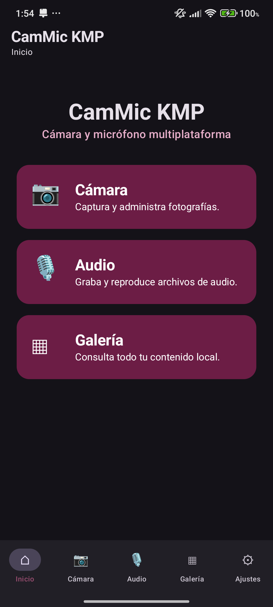<br>
Menú principal de CamMic KMP.
</td>
<td align="center">
<b>Cámara</b><br>
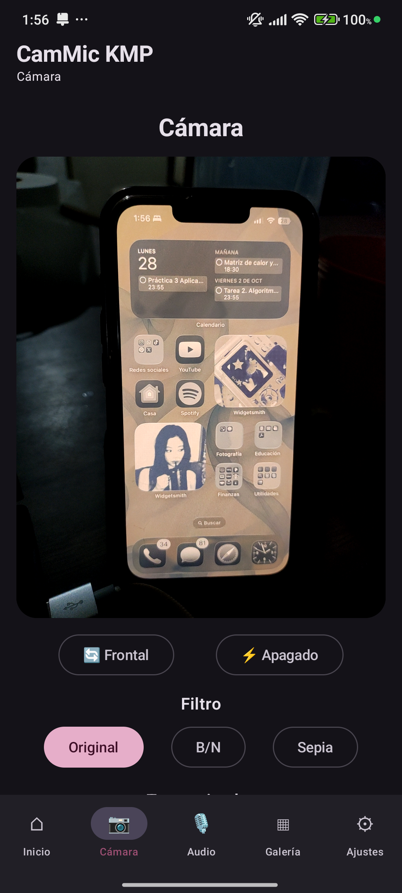<br>
Vista previa, flash, filtros y temporizador.
</td>
<td align="center">
<b>Resultado de filtros</b><br>
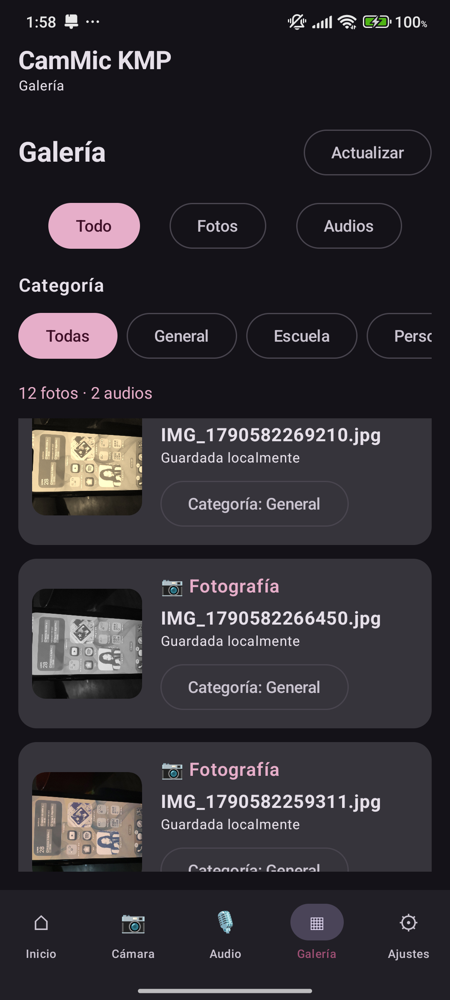<br>
Miniaturas de fotografías procesadas después de la captura.
</td>
</tr>
</table>

> Los filtros B/N y Sepia se aplican al archivo capturado. Por diseño, el preview de CameraX permanece sin filtro.

## Grabación y reproducción de audio

<table>
<tr>
<td align="center">
<b>Grabación</b><br>
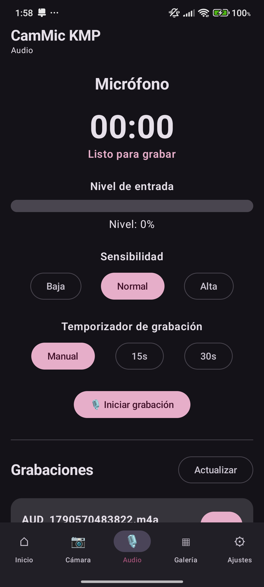<br>
Temporizador, nivel de entrada y sensibilidad.
</td>
<td align="center">
<b>Reproducción</b><br>
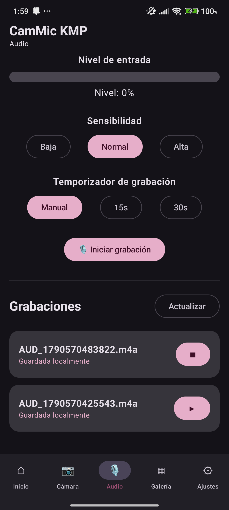<br>
Listado y reproducción local de grabaciones.
</td>
</tr>
</table>

## Galería y categorías

<table>
<tr>
<td align="center">
<b>Galería completa</b><br>
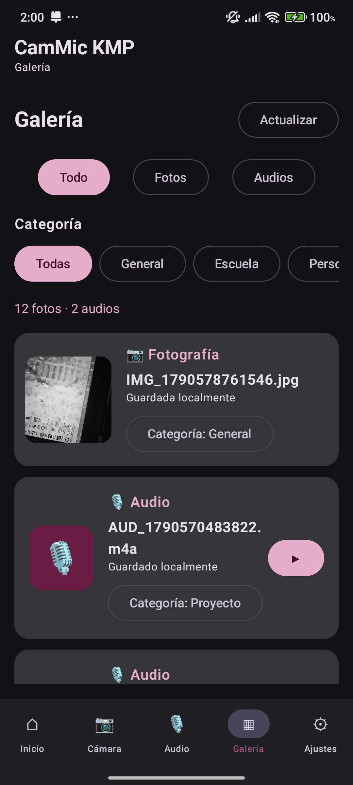<br>
Fotografías y audios en una sola pantalla.
</td>
<td align="center">
<b>Filtro por categoría</b><br>
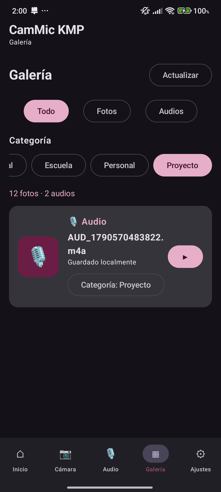<br>
Contenido filtrado por categoría.
</td>
<td align="center">
<b>Categoría alternativa</b><br>
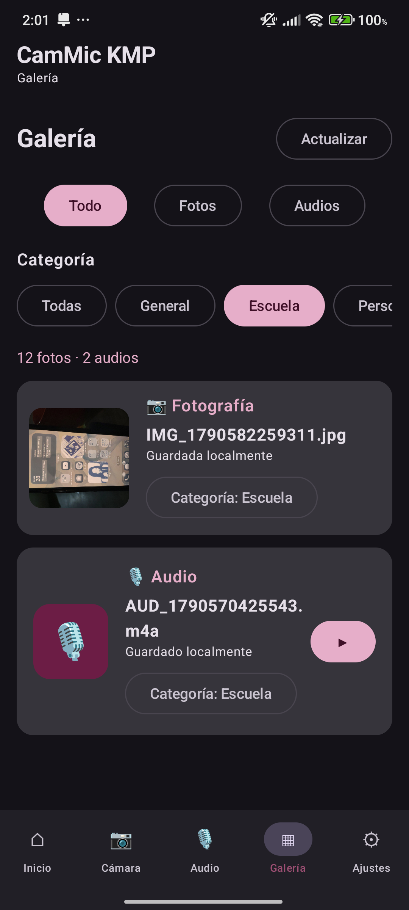<br>
Asignación y consulta persistente.
</td>
</tr>
</table>

## Temas y adaptación al sistema

<table>
<tr>
<td align="center">
<b>Tema Guinda IPN</b><br>
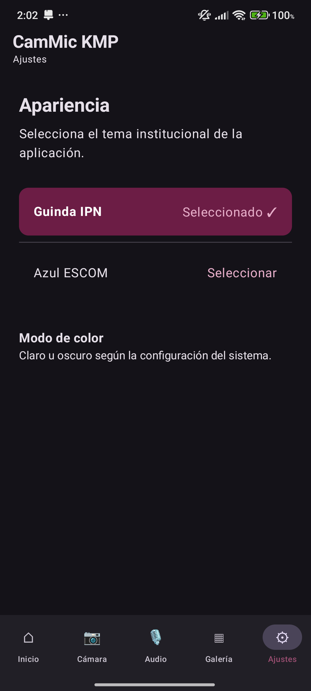
</td>
<td align="center">
<b>Tema Azul ESCOM</b><br>
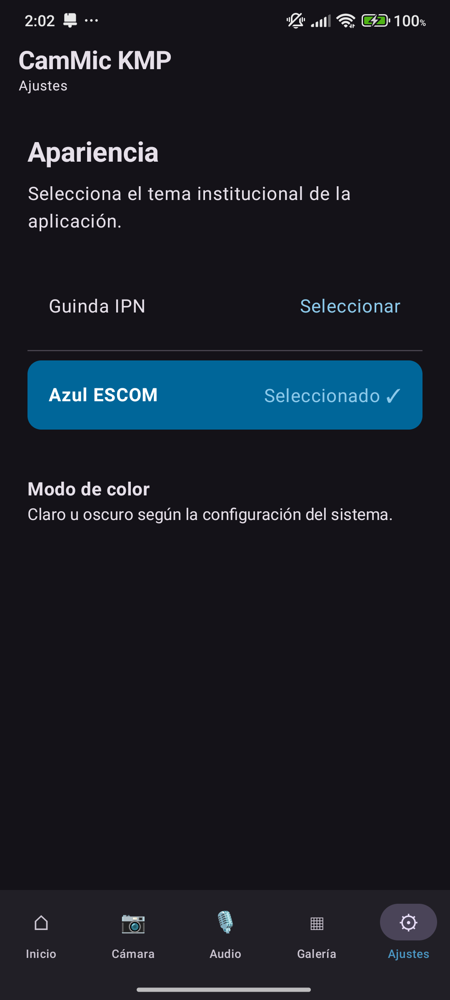
</td>
<td align="center">
<b>Modo claro</b><br>
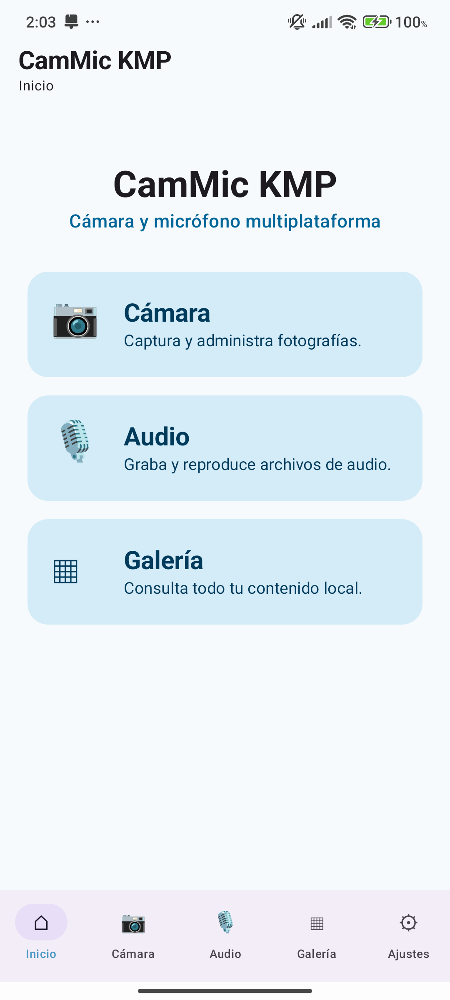
</td>
</tr>
</table>

La mayoría de las capturas se realizaron con el dispositivo configurado en **modo oscuro**. La captura `09_modo_claro.png` demuestra la adaptación automática al modo claro del sistema.

---

# 12. Pruebas realizadas en Android

| Prueba | Resultado |
|---|---|
| Inicio de la aplicación | ✅ Correcto |
| Navegación entre las cinco secciones | ✅ Correcto |
| Solicitud de permiso de cámara | ✅ Correcto |
| Solicitud de permiso de micrófono | ✅ Correcto |
| Vista previa de cámara | ✅ Correcto |
| Captura de fotografía | ✅ Correcto |
| Cámara frontal / trasera | ✅ Correcto |
| Flash OFF / ON / AUTO | ✅ Correcto |
| Temporizador 3 s y 5 s | ✅ Correcto |
| Filtro Original | ✅ Correcto |
| Filtro Blanco y negro | ✅ Correcto |
| Filtro Sepia | ✅ Correcto |
| Persistencia de fotografías | ✅ Correcto |
| Grabación de audio | ✅ Correcto |
| Temporizador de audio | ✅ Correcto |
| Sensibilidad del micrófono | ✅ Correcto |
| Reproducción de audio | ✅ Correcto |
| Galería unificada | ✅ Correcto |
| Filtrado Todo / Fotos / Audios | ✅ Correcto |
| Asignación de categorías | ✅ Correcto |
| Persistencia de categorías | ✅ Correcto |
| Tema Guinda IPN | ✅ Correcto |
| Tema Azul ESCOM | ✅ Correcto |
| Persistencia del tema | ✅ Correcto |
| Modo oscuro | ✅ Correcto |
| Modo claro | ✅ Correcto |
| Funcionamiento sin Internet | ✅ Correcto |

### Dispositivo utilizado

```text
Xiaomi 22021211RG
Android API 34
```

---

# 13. Instalación y ejecución en Android

## Requisitos

- Android Studio con soporte para Kotlin Multiplatform.
- JDK compatible con el proyecto.
- Android SDK instalado.
- Dispositivo Android físico o emulador con API compatible.
- Permisos de cámara y micrófono disponibles.

## Abrir el proyecto

1. Clonar o descargar el repositorio.
2. Abrir Android Studio.
3. Seleccionar **Open**.
4. Abrir:

```text
Ejercicio5/CamMicKMP
```

5. Esperar a que Gradle termine la sincronización.
6. Seleccionar la configuración:

```text
androidApp
```

7. Elegir un dispositivo.
8. Presionar **Run ▶**.
9. Aceptar los permisos de cámara y micrófono cuando Android los solicite.

---

# 14. Generación del APK

El APK Android se generó correctamente desde Android Studio.

Ruta generada:

```text
CamMicKMP/
└── androidApp/
    └── build/
        └── outputs/
            └── apk/
                └── debug/
                    └── androidApp-debug.apk
```

También puede generarse desde Android Studio mediante:

```text
Build
→ Generate App Bundles or APKs
→ Generate APKs
```

o mediante la opción equivalente **Build APK(s)**, dependiendo de la versión de Android Studio.

### APK generado

```text
androidApp-debug.apk
```

Tamaño observado durante la entrega:

```text
aprox. 16.4 MB
```

> La carpeta `build/` y los archivos `*.apk` están ignorados por la configuración de Git del proyecto. Por esta razón, el APK debe entregarse como archivo independiente o publicarse como artefacto/Release en GitHub si se desea mantenerlo disponible fuera del repositorio.

---

# 15. Estado de iOS y validación pendiente en macOS

El proyecto contiene la estructura requerida para iOS:

```text
iosApp/
shared/src/iosMain/
```

Sin embargo, durante el cierre de esta entrega **no se completó la validación funcional en Xcode ni en un simulador/dispositivo iPhone**.

Por lo tanto, no se presentan capturas de iOS como si hubieran sido verificadas.

## Estado actual

| Área | Estado |
|---|---|
| Estructura `iosApp` | ✅ Incluida |
| Source set `iosMain` | ✅ Incluido |
| Contratos `expect/actual` | ✅ Estructurados |
| Persistencia de preferencias con `NSUserDefaults` | ✅ Implementada |
| Validación de compilación en Xcode | ⏳ Pendiente |
| Ejecución en simulador de iPhone | ⏳ Pendiente |
| Prueba de cámara iOS | ⏳ Pendiente |
| Prueba de micrófono iOS | ⏳ Pendiente |
| Capturas del simulador | ⏳ Pendiente |
| IPA | ⏳ Pendiente |

### Evidencia a agregar cuando se disponga de macOS/Xcode

Crear:

```text
docs/
└── ios/
    ├── 00_inicio_ios.png
    ├── 01_camara_ios.png
    ├── 02_audio_ios.png
    └── 03_galeria_ios.png
```

Posteriormente completar:

- [ ] abrir `iosApp` en Xcode;
- [ ] seleccionar un simulador de iPhone;
- [ ] compilar el proyecto;
- [ ] verificar el arranque de la interfaz;
- [ ] validar permisos;
- [ ] probar cámara;
- [ ] probar grabación y reproducción;
- [ ] probar galería;
- [ ] verificar temas Guinda/Azul;
- [ ] verificar modo claro/oscuro;
- [ ] agregar capturas;
- [ ] generar IPA si el entorno y firma lo permiten.

### Resultado de prueba macOS/iOS

```text
Fecha de prueba: ______________________________

Versión de macOS: _____________________________

Versión de Xcode: _____________________________

Simulador / dispositivo: ______________________

Resultado de compilación: _____________________

Resultado de ejecución: _______________________

Observaciones:
________________________________________________
________________________________________________
________________________________________________
```

> Esta sección deberá actualizarse cuando el proyecto sea probado en un entorno macOS funcional.

---

# 16. Comparación: Flutter vs Kotlin Multiplatform

| Aspecto | Flutter | Kotlin Multiplatform |
|---|---|---|
| Lenguaje | Dart | Kotlin |
| Construcción de UI | Árbol de widgets de Flutter | Compose Multiplatform o interfaces nativas por plataforma |
| Acceso a APIs nativas | Generalmente mediante plugins o platform channels | Puede utilizar APIs nativas directamente desde `androidMain` / `iosMain` |
| Código compartido | Alto: normalmente UI y lógica | Flexible: lógica compartida y, con Compose Multiplatform, también gran parte de la UI |
| Integración Android | Requiere el runtime y ecosistema Flutter | Muy directa al utilizar Kotlin y APIs Android |
| Integración iOS | Plugins y código Swift/Objective-C cuando es necesario | Kotlin/Native y código específico en `iosMain`, con posibilidad de interoperar con APIs Apple |
| Estado / asincronía | `setState`, Provider, Bloc, Riverpod, etc. | Coroutines, Flow, StateFlow y estado de Compose |
| Tamaño del binario | Incluye el runtime y motor de Flutter | Depende de los targets y bibliotecas utilizadas; Compose Multiplatform también añade dependencias |
| Curva de aprendizaje | Requiere aprender Dart y el modelo de widgets | Familiar para desarrolladores Kotlin/Android; Kotlin/Native y APIs iOS añaden complejidad |
| Madurez del ecosistema | Ecosistema amplio de paquetes multiplataforma | Ecosistema en crecimiento y fuerte integración con tecnologías Kotlin |
| APIs de cámara/micrófono | Frecuentemente resueltas mediante paquetes | Implementación específica por plataforma con APIs nativas |
| Nivel de control nativo | Alto, pero con integración adicional cuando se sale del ecosistema de plugins | Alto al poder trabajar directamente en los source sets de cada plataforma |

---

# 17. Conclusión Flutter vs KMP

Para una aplicación que utiliza recursos del dispositivo como cámara, micrófono, almacenamiento y permisos, Kotlin Multiplatform ofrece una ventaja importante: permite mantener una base compartida y, al mismo tiempo, implementar el acceso específico a cada plataforma con sus APIs nativas.

En Android esto se observó claramente con el uso directo de CameraX, `MediaRecorder`, `MediaPlayer`, almacenamiento privado y permisos nativos, manteniendo la interfaz principal en Compose Multiplatform.

Flutter, por otro lado, facilita una experiencia multiplataforma muy uniforme y suele permitir avanzar rápidamente cuando existe un plugin maduro para la funcionalidad necesaria. En KMP se obtiene mayor flexibilidad para trabajar directamente con la plataforma, aunque esa flexibilidad implica más responsabilidad al implementar y probar las partes específicas de Android e iOS.

Para **CamMic KMP**, el enfoque KMP resultó adecuado en la implementación Android porque permitió combinar código compartido con acceso directo a las APIs del sistema. La evaluación completa entre Flutter y KMP para ambas plataformas deberá complementarse cuando se finalice la validación de la versión iOS en Xcode.

---

# 18. Limitaciones conocidas

- Los filtros de fotografía se aplican **después de la captura** y no sobre la vista previa.
- La cámara frontal desactiva el flash físico.
- Las fotografías y audios se almacenan dentro del espacio privado de la aplicación y no se exportan automáticamente a las aplicaciones Galería/Archivos del sistema.
- Las categorías actuales son:
  - General;
  - Escuela;
  - Personal;
  - Proyecto.
- No se implementó sincronización en la nube.
- La aplicación está diseñada para trabajar completamente de forma local.
- La validación final de las funciones de hardware en iOS queda pendiente.

---

**Instituto Politécnico Nacional — Escuela Superior de Cómputo**  
**Desarrollo de Aplicaciones Móviles Nativas**  
**28 de septiembre de 2026**
